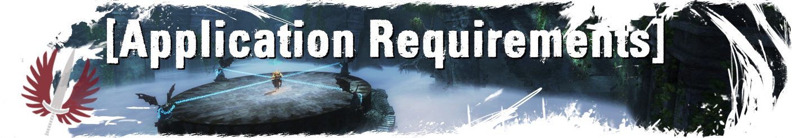

```diff
- Rule [1]: Respect others
We encourage joking around and friendly humour but not toxicity, frustration, inappropriate behaviour, and name-shaming. In particular, we do not tolerate berating or mocking new players and trainees - remember that we were all new once.
```
```diff
- Rule [2]: Don't be inappropriate
There will be no racism, sexism, hate speech, dark humour, NSFW/NSFL, or similar unbecoming content in the Discord, TeamSpeak, guild chat, or RTI-organised runs. Moderators may deem messages as unbecoming or inappropriate at their own discretion.
```
```diff
- Rule [3]: Keep it to DMs
Any personal feuds or "drama" between guild members should be moved to direct messages or whispers or brought to the attention of an officer.
```
```diff
- Rule [4]: Prepare adequately
Please ensure you come with a suitable raid-ready build (see the #faq channel for more information), fully read the description of any raid you sign up to, and adhere to any requirements. This is especially important for kill runs, where more familiarity with the encounter and your role are expected.
```
```diff
- Rule [5]: Be punctual and prudent
If you sign up for a raid, we expect that you show up on time and that you stay for the specified duration of the raid. If you learn that you can't make it, we expect you to unregister at least 30 minutes before the raid is scheduled to start.
```
```diff
- Rule [6]: Follow the Guild Wars 2 rules
We expect all of our members to follow the Guild Wars 2 user agreement and code of conduct while in-game.
```
```diff
- Rule [7]: Don't commit cyber crime
Do not engage in illegal or counterfeit activities through our chat channels. This includes fraud, cyber bullying, sharing computer viruses, piracy, phishing, identity theft, etc.
```
```diff
- Rule [8]: No LI/KP requirements
The whole point of this guild is to help new players raid. Groups you organise must not require LI/KP from RTI members. The only exception we make to this rule is when you are in a pug group unrelated to RTI that set their own requirements, in which case this must be clearly stated. Note that asking for experience or knowledge of a fight is permissible.
```
```diff
- Rule [9]: Don't spam
Spam includes posting the same or similar messages multiple times, pinging people unnecessarily, posting constantly in inappropriate channels, posting several irrelevant/random "memes", etc.
```
```diff
- Rule [10]: Do not misspell "Qadim"
It's spelled "Qadim". Not "Quadim". Seriously.
```



`[1]` Your Guild Wars 2 account must be on the :flag_eu: **EU** server.
`[2]` You must have Discord available to join voice chat (there is no requirement to speak).
`[3]` You must have at least one raid-ready character properly geared with a meta build.
`[4]` You must be able to understand English.


_ _
