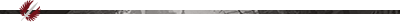

```diff
- [Who We Are]
```
We're a community built around being an entry point into PvE raiding. Getting into the game mode can seem impossible without any knowledge regarding the standards, requirements and so forth. RTI is here to help you and provide you with a friendly environment to walk through the steps in becoming a raider without the infamous requirements and toxicity of the underworld known as the LFG. We offer a guild with open minded people who are willing to help you with any questions you might have.

Our @Officers:
-ping officers one by one-
_ _

```diff
- [What We Expect From You]
```
We expect an active interest in learning and improving in raids. This includes everything from class knowledge to strategies employed on the different bosses. We have a lot of resources, experienced players, and raid commanders willing to help you, and no question is too "nooby" to ask. Never forget that!

Being a part of our community, you also need to have an open mind for different opinions and perspectives. What a good player is, or what meta is, can vary dramatically from person to person, and thus, we expect you to respect other people's views and resolve differences through friendly discussion.

Last but not least, we ask you to never forget where you came from, what it was like when you first joined so that you can contribute to our guild by helping new players and welcome them to our guild in the same way that we have welcomed you.
_ _

```diff
- [Closing Notes]
```
If RTI seems like the right place for you, then please be sure to read our #rules. Then, hit the checkbox at the bottom to have access to the rest of our server!

We look forward to raiding with you!
- RTI


Once you have read the above, including the #rules, click on the :white_check_mark: reaction to gain access to our other channels!

