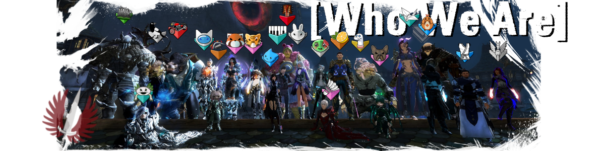
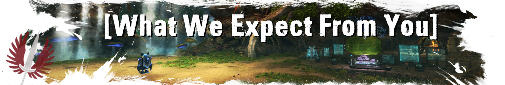
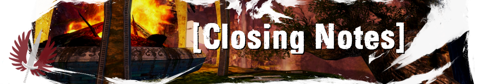
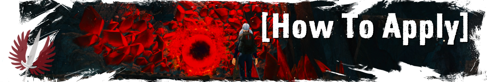

We're a community built around being an entry point into PvE raiding. Getting into the game mode can seem impossible without any knowledge regarding the standards, requirements and so forth. RTI is here to help you and provide you with a friendly environment to walk through the steps in becoming a raider without the infamous requirements and toxicity of the underworld known as the LFG. We offer a guild with open minded people who are willing to help you with any questions you might have.
_ _

We expect an active interest in learning and improving in raids. This includes everything from class knowledge to strategies employed on the different bosses. We have a lot of resources, experienced players, and raid commanders willing to help you, and no question is too "nooby" to ask. Never forget that!

Being a part of our community, you also need to have an open mind for different opinions and perspectives. What a good player is, or what meta is, can vary dramatically from person to person, and thus, we expect you to respect other people's views and resolve differences through friendly discussion.

Last but not least, we ask you to never forget where you came from, what it was like when you first joined so that you can contribute to our guild by helping new players and welcome them to our guild in the same way that we have welcomed you. If you ever get lost, consult our quickstart guide here:
<https://tinyurl.com/rtiquickstart>
_ _

If RTI seems like the right place for you, then make sure you read our rules and application requirements in #rules, and then hit the ✅ below to join our community and gain access to our raids.

We look forward to raiding with you!
- RTI
_ _

You can apply to RTI by clicking the ✅ at the bottom of this message. You will then be approved shortly.
Be sure to turn on the ability to receive DMs from this server (in your **Privacy Settings** for the server) or else you won't receive DMs from the bot to apply to the guild. If you have any questions, contact an @Officer!
To get priority for training registration if you did not kill all bosses yet, check out #training_requests!

